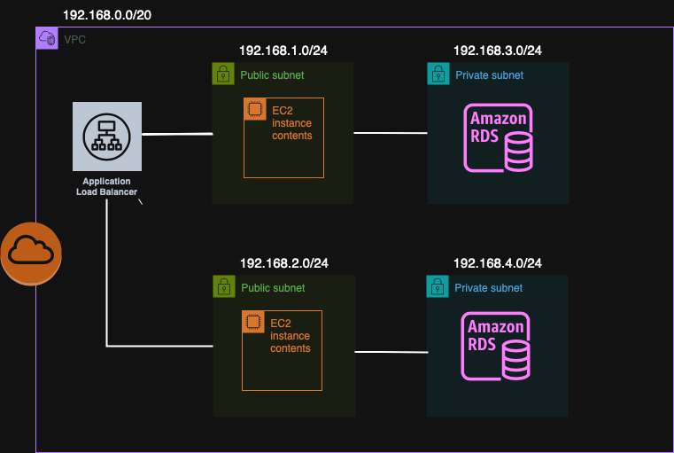

## はじめに
本リポジトリはUdemyの講座「[インフラの手運用なんてもうイヤだ！そんなあなたに贈る Infrastracture as Code の大本命！AWS上の環境構築をコーディングしよう！](https://www.udemy.com/course/iac-with-terraform/?couponCode=KEEPLEARNING)
」を基にAWSのサーバー構築を練習したものです。

基本的にterraformのコードは上記の講座を基にしています。  
一部セキュリティグループ、EC2などを追加しています。

## 作成されるVPC
本terraformで作成されるAWSのVPCの図面は以下になります。  
各サブネットTCPポートなどはsecurity_group.tfを参考にしてください。

## 最後に
本プログラムは2025.7 - 2025.8の休業補償期間中に作成しました。
7月後半に愛犬が亡くなり、8月の空いた時間を使いました。
s勉強のお時間を頂いた愛犬モモに感謝申し上げます。
